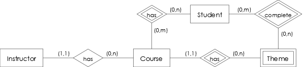
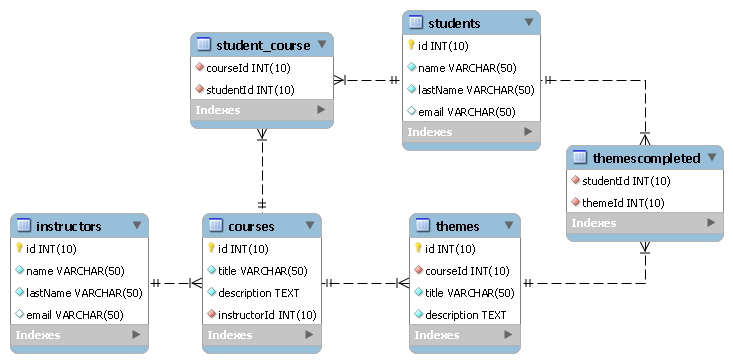
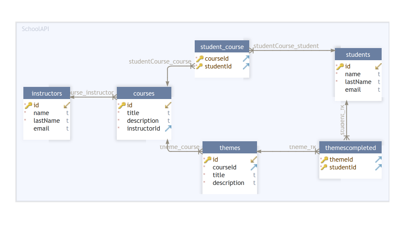
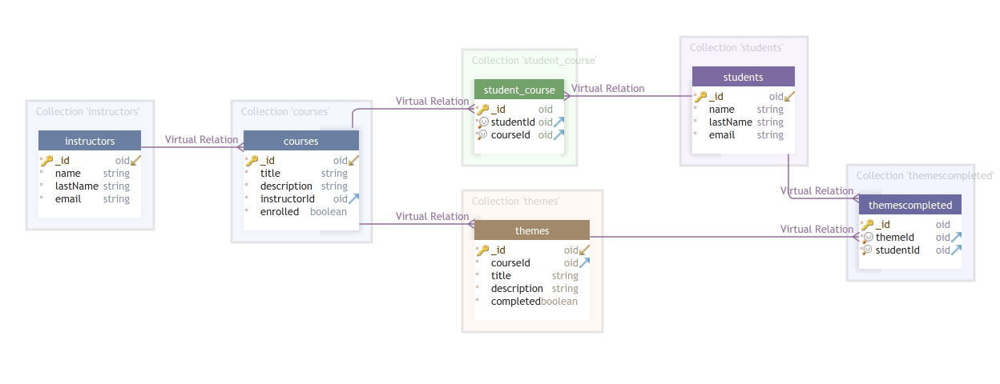
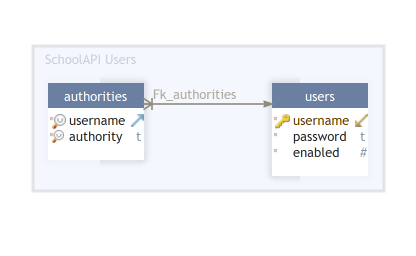

# ScholarAPI

## Descripción
**ScholarAPI** es una interfaz de programación de aplicaciones (**API**: [Application Programming Interface](https://www.google.com/search?q=application+programming+interface)), realizada en diferentes lenguajes de programación del lado *Backend* (por ejemplo: Java, PHP, Python) para la gestión de cursos en línea (basado en la plataforma [Platzi](https://platzi.com)).

## Características funcionales
- Autenticación a la API con usuario y contraseña (Basic Auth).
- Validación de roles de usuario (Admin, Instructor, Student) con sus respectivos permisos.
- Registro y consulta de **Estudiantes**, **Instructores** y **Cursos** (con sus respectivos temas).
- Asociación de estudiantes a cada uno de los cursos.
- Marcar temas de un curso como completados por parte del estudiante.

## Componentes de la solución

### Base de datos
La base de datos del proyecto es implementada a partir del modelo Entidad-Relación descrito en la siguiente imagen, en cada uno de los Sistemas de gestión de bases de datos (**DBMS**: [Database Management System](https://www.google.com/search?q=database+management+system)) descritos.



- MySQL



- PostgreSQL



- MongoDB



Así mismo, se cuenta con una base de datos en [SQLite](https://www.google.com/search?q=sqlite) en la que se tiene el registro de cada unos de los usuarios (con sus respectivos roles) que pueden hacer uso de la API.



### Lógica de la aplicación
La implementación de la parte lógica de la API es realizada en diferentes lenguajes de programación del lado Backend (apoyado en diferentes frameworks); los cuales se describen a continuación.
- Java: [Spring Boot](https://www.google.com/search?q=Spring+Boot) ([ver proyecto](https://github.com/cesargomez05/schoolapi_springboot))
- PHP: [Laravel](https://www.google.com/search?q=Laravel) ([ver proyecto](https://github.com/cesargomez05/schoolapi_laravel))
- PHP: [Lumen](https://www.google.com/search?q=Lumen) ([ver proyecto](https://github.com/cesargomez05/schoolapi_lumen))
- Node.js: [Express.js](https://www.google.com/search?q=Express.js) ([ver proyecto](https://github.com/cesargomez05/schoolapi_expressjs))
- Node.js: [Sails.js](https://www.google.com/search?q=Sails.js) ([ver proyecto](https://github.com/cesargomez05/schoolapi_sailsjs))
- Python: [Flask](https://www.google.com/search?q=Flask) ([ver proyecto](https://github.com/cesargomez05/schoolapi_flask))
- Python: [FastAPI](https://www.google.com/search?q=FastAPI) (en construcción)
- Node.js: [Nest.js](https://www.google.com/search?q=Nest.js) (en construcción)

### Usos de la API
La API **ScholarAPI** puede ser consumida desde:
- Aplicaciones realizadas mediante frameworks del lado Frontend (React, Vue, Angular, etc.)
- Aplicaciones de terceros con soporte para webhooks.
- Aplicaciones realizadas en otros lenguajes como Java, PHP, JavaScript, entre otros.

## Configuración general de la API
Para hacer uso de la API se debe realizar los pasos descritos a continuación.
- Ejecutar o configurar en ambiente local alguna de las implementaciones disponibles, siguiendo los respectivos pasos.
- Obtener la URL base de la API en ejecución, la cual se referenciará con el valor `base_url` en la documentación.
- Establecer en la URL la base de datos sobre la cual se desea realizar el registro y consulta de información.

| Base de datos | URL de acceso |
| - | - |
| MySQL | `base_url/mysql` |
| PostgreSQL | `base_url/postgresql` |
| MongoDB | `base_url/mongodb` |

## Roles de usuario
La API cuenta con los roles de usuario descritos a continuación.

- **Admin** (Administrador).
- **Instructor** (Instructor).
- **Student** (Estudiante).

## Módulos disponibles
A continuación, se describe cada uno de los módulos disponibles en la API **ScholarAPI**.

### Estudiantes (Students)
Permite gestionar la información de los estudiantes.

#### Atributos (Student)

| Campo | Descripción
| - | - |
| `id` | Id del estudiante (`_id` para MongoDB).<br>**Nota**: este atributo no será visible para el rol **Student**. |
| `name` | Nombre del estudiante. |
| `lastName` | Apellidos del estudiante. |
| `email` | Correo electrónico del estudiante. |

#### GET `/students`
Obtiene la lista de estudiantes.

##### Permisos
- **Admin**: ✔️
- **Instructor**: ✔️
- **Student**: ❌

##### Parámetros de consulta
> base_url/{database}/students?value=value&page=1

| Parámetro | Descripción
| - | - |
| value | Valor de búsqueda del estudiante (nombre, apellidos, correo). |
| page | Número de página del grupo de registros. |

##### Respuesta
> 200 OK
```json
[
	{
		"id": "string",
		"name": "string",
		"lastName": "string",
		"email": "string"
	},
	{
		"id": "string",
		"name": "string",
		"lastName": "string",
		"email": "string"
	},
	...
]
```

##### Respuestas de error
- [Parámetros de consulta inválidos (Error 400)](#parámetros-de-consulta-inválidos-error-400)
- [Acceso no autorizado a la API (Error 401)](#acceso-no-autorizado-a-la-api-error-401)
- [Acceso no autorizado a un recurso (Error 403)](#acceso-no-autorizado-a-un-recurso-error-403)

#### GET `/students/STUDENT_ID`
Obtiene los datos de un estudiante.

##### Permisos
- **Admin**: ✔️
- **Instructor**: ✔️
- **Student**: ❌

##### Parámetros de ruta
| Parámetro | Descripción
| - | - |
| STUDENT_ID | Id del estudiante. |

##### Respuesta
> 200 OK
```json
{
	"id": "string",
	"name": "string",
	"lastName": "string",
	"email": "string"
}
```

##### Respuestas de error
- [Valor de Id inválido (Error 400)](#valor-de-id-inválido-error-400)
- [Acceso no autorizado a la API (Error 401)](#acceso-no-autorizado-a-la-api-error-401)
- [Acceso no autorizado a un recurso (Error 403)](#acceso-no-autorizado-a-un-recurso-error-403)
- [Recurso no encontrado (Error 404)](#recurso-no-encontrado-error-404)

#### GET `/students/me`
Obtiene los datos del estudiante autenticado en la API (si este tiene rol Estudiante).

##### Permisos
- **Admin**: ❌
- **Instructor**: ❌
- **Student**: ✔️

##### Respuesta
> 200 OK
```json
{
	"id": "string",
	"name": "string",
	"lastName": "string",
	"email": "string"
}
```

##### Respuestas de error
- [Acceso no autorizado a la API (Error 401)](#acceso-no-autorizado-a-la-api-error-401)
- [Acceso no autorizado a un recurso (Error 403)](#acceso-no-autorizado-a-un-recurso-error-403)
- [Recurso no encontrado (Error 404)](#recurso-no-encontrado-error-404)

#### POST `/students`
Inserta un nuevo estudiante.

##### Permisos
- **Admin**: ✔️
- **Instructor**: ❌
- **Student**: ❌

##### Cuerpo de la petición
```json
{
	"name": "string",
	"lastName": "string",
	"email": "string"
}
```
| Parámetro | Descripción
| - | - |
| name | Nombre del estudiante. |
| lastName | Apellidos del estudiante. |
| email | Correo electrónico *(opcional)*. |

##### Respuesta
> 201 Created
```json
{
	"id": "string",
	"name": "string",
	"lastName": "string",
	"email": "string"
}
```

##### Respuestas de error
- [Error de validación de los datos (Error 400)](#error-de-validación-de-los-datos-error-400)
- [Acceso no autorizado a la API (Error 401)](#acceso-no-autorizado-a-la-api-error-401)
- [Acceso no autorizado a un recurso (Error 403)](#acceso-no-autorizado-a-un-recurso-error-403)

#### PUT `/students/STUDENT_ID`
Sobreescribe los datos de un estudiante.

##### Permisos
- **Admin**: ✔️
- **Instructor**: ❌
- **Student**: ❌

##### Parámetros de ruta
| Parámetro | Descripción
| - | - |
| STUDENT_ID | Id del estudiante. |

##### Cuerpo de la petición
```json
{
	"name": "string",
	"lastName": "string",
	"email": "string"
}
```
| Parámetro | Descripción
| - | - |
| name | Nombre del estudiante. |
| lastName | Apellidos del estudiante. |
| email | Correo electrónico *(opcional)*. |

##### Respuesta
> 200 OK
```json
{
	"message": "Student has been updated successfully"
}
```

##### Respuestas de error
- [Valor de Id inválido (Error 400)](#valor-de-id-inválido-error-400)
- [Error de validación de los datos (Error 400)](#error-de-validación-de-los-datos-error-400)
- [Acceso no autorizado a la API (Error 401)](#acceso-no-autorizado-a-la-api-error-401)
- [Acceso no autorizado a un recurso (Error 403)](#acceso-no-autorizado-a-un-recurso-error-403)
- [Recurso no encontrado (Error 404)](#recurso-no-encontrado-error-404)

#### PUT `/students/me`
Sobreescribe los datos del estudiante autenticado en la API (si este tiene rol Estudiante).

##### Permisos
- **Admin**: ❌
- **Instructor**: ❌
- **Student**: ✔️

##### Cuerpo de la petición
```json
{
	"name": "string",
	"lastName": "string",
	"email": "string"
}
```
| Parámetro | Descripción
| - | - |
| name | Nombre del estudiante. |
| lastName | Apellidos del estudiante. |
| email | Correo electrónico *(opcional)*. |

##### Respuesta
> 200 OK
```json
{
	"message": "Student has been updated successfully"
}
```

##### Respuestas de error
- [Error de validación de los datos (Error 400)](#error-de-validación-de-los-datos-error-400)
- [Acceso no autorizado a la API (Error 401)](#acceso-no-autorizado-a-la-api-error-401)
- [Acceso no autorizado a un recurso (Error 403)](#acceso-no-autorizado-a-un-recurso-error-403)
- [Recurso no encontrado (Error 404)](#recurso-no-encontrado-error-404)

#### PATCH `/students/STUDENT_ID`
Actualiza los datos de un estudiante.

##### Permisos
- **Admin**: ✔️
- **Instructor**: ❌
- **Student**: ❌

##### Parámetros de ruta
| Parámetro | Descripción
| - | - |
| STUDENT_ID | Id del estudiante. |

##### Cuerpo de la petición
```json
{
	"name": "string",
	"lastName": "string",
	"email": "string"
}
```
| Parámetro | Descripción
| - | - |
| name | Nombre del estudiante *(opcional)*. |
| lastName | Apellidos del estudiante *(opcional)*. |
| email | Correo electrónico *(opcional)*. |

##### Respuesta
> 200 OK
```json
{
	"message": "Student has been updated successfully"
}
```

##### Respuestas de error
- [Valor de Id inválido (Error 400)](#valor-de-id-inválido-error-400)
- [Error de validación de los datos (Error 400)](#error-de-validación-de-los-datos-error-400)
- [Acceso no autorizado a la API (Error 401)](#acceso-no-autorizado-a-la-api-error-401)
- [Acceso no autorizado a un recurso (Error 403)](#acceso-no-autorizado-a-un-recurso-error-403)
- [Recurso no encontrado (Error 404)](#recurso-no-encontrado-error-404)

#### PATCH `/students/me`
Actualiza los datos del estudiante autenticado en la API (si este tiene rol Estudiante).

##### Permisos
- **Admin**: ❌
- **Instructor**: ❌
- **Student**: ✔️

##### Cuerpo de la petición
```json
{
	"name": "string",
	"lastName": "string",
	"email": "string"
}
```
| Parámetro | Descripción
| - | - |
| name | Nombre del estudiante *(opcional)*. |
| lastName | Apellidos del estudiante *(opcional)*. |
| email | Correo electrónico *(opcional)*. |

##### Respuesta
> 200 OK
```json
{
	"message": "Student has been updated successfully"
}
```

##### Respuestas de error
- [Error de validación de los datos (Error 400)](#error-de-validación-de-los-datos-error-400)
- [Acceso no autorizado a la API (Error 401)](#acceso-no-autorizado-a-la-api-error-401)
- [Acceso no autorizado a un recurso (Error 403)](#acceso-no-autorizado-a-un-recurso-error-403)
- [Recurso no encontrado (Error 404)](#recurso-no-encontrado-error-404)

#### DELETE `/students/STUDENT_ID`
Elimina los datos de un estudiante.

##### Permisos
- **Admin**: ✔️
- **Instructor**: ❌
- **Student**: ❌

##### Parámetros de ruta
| Parámetro | Descripción
| - | - |
| STUDENT_ID | Id del estudiante. |

##### Respuesta
> 200 OK
```json
{
	"message": "Student has been deleted successfully"
}
```

##### Respuestas de error
- [Valor de Id inválido (Error 400)](#valor-de-id-inválido-error-400)
- [Acceso no autorizado a la API (Error 401)](#acceso-no-autorizado-a-la-api-error-401)
- [Acceso no autorizado a un recurso (Error 403)](#acceso-no-autorizado-a-un-recurso-error-403)
- [Recurso no encontrado (Error 404)](#recurso-no-encontrado-error-404)
- [Recursos asociados al recurso a eliminar (Error 409)](#recursos-asociados-al-recurso-a-eliminar-error-409)

### Instructores (Instructors)
Permite gestionar la información de los instructores.

#### Atributos (Instructor)

| Campo | Descripción
| - | - |
| `id` | Id del instructor (`_id` para MongoDB).<br>**Nota**: este atributo no será visible para el rol **Instructor** |
| `name` | Nombre del instructor. |
| `lastName` | Apellidos del instructor. |
| `email` | Correo electrónico del instructor. |

#### GET `/instructors`
Obtiene la lista de instructores.

##### Permisos
- **Admin**: ✔️
- **Instructor**: ❌
- **Student**: ❌

##### Parámetros de consulta
> base_url/{database}/instructors?value=value&page=1

| Parámetro | Descripción
| - | - |
| value | Valor de búsqueda del instructor (nombre, apellidos, correo). |
| page | Número de página del grupo de registros. |

##### Respuesta
> 200 OK
```json
[
	{
		"id": "string",
		"name": "string",
		"lastName": "string",
		"email": "string"
	},
	{
		"id": "string",
		"name": "string",
		"lastName": "string",
		"email": "string"
	},
	...
]
```

##### Respuestas de error
- [Parámetros de consulta inválidos (Error 400)](#parámetros-de-consulta-inválidos-error-400)
- [Acceso no autorizado a la API (Error 401)](#acceso-no-autorizado-a-la-api-error-401)
- [Acceso no autorizado a un recurso (Error 403)](#acceso-no-autorizado-a-un-recurso-error-403)

#### GET `/instructors/INSTRUCTOR_ID`
Obtiene los datos de un instructor.

##### Permisos
- **Admin**: ✔️
- **Instructor**: ❌
- **Student**: ❌

##### Parámetros de ruta
| Parámetro | Descripción
| - | - |
| INSTRUCTOR_ID | Id del instructor. |

##### Respuesta
> 200 OK
```json
{
	"id": "string",
	"name": "string",
	"lastName": "string",
	"email": "string"
}
```

##### Respuestas de error
- [Valor de Id inválido (Error 400)](#valor-de-id-inválido-error-400)
- [Acceso no autorizado a la API (Error 401)](#acceso-no-autorizado-a-la-api-error-401)
- [Acceso no autorizado a un recurso (Error 403)](#acceso-no-autorizado-a-un-recurso-error-403)
- [Recurso no encontrado (Error 404)](#recurso-no-encontrado-error-404)

#### GET `/instructors/me`
Obtiene los datos del instructor autenticado en la API (si este tiene rol Instructor).

##### Permisos
- **Admin**: ❌
- **Instructor**: ✔️
- **Student**: ❌

##### Respuesta
> 200 OK
```json
{
	"id": "string",
	"name": "string",
	"lastName": "string",
	"email": "string"
}
```

##### Respuestas de error
- [Acceso no autorizado a la API (Error 401)](#acceso-no-autorizado-a-la-api-error-401)
- [Acceso no autorizado a un recurso (Error 403)](#acceso-no-autorizado-a-un-recurso-error-403)
- [Recurso no encontrado (Error 404)](#recurso-no-encontrado-error-404)

#### POST `/instructors`
Inserta un nuevo instructor.

##### Permisos
- **Admin**: ✔️
- **Instructor**: ❌
- **Student**: ❌

##### Cuerpo de la petición
```json
{
	"name": "string",
	"lastName": "string",
	"email": "string"
}
```
| Parámetro | Descripción
| - | - |
| name | Nombre del instructor. |
| lastName | Apellidos del instructor. |
| email | Correo electrónico *(opcional)*. |

##### Respuesta
> 201 Created
```json
{
	"id": "string",
	"name": "string",
	"lastName": "string",
	"email": "string"
}
```

##### Respuestas de error
- [Error de validación de los datos (Error 400)](#error-de-validación-de-los-datos-error-400)
- [Acceso no autorizado a la API (Error 401)](#acceso-no-autorizado-a-la-api-error-401)
- [Acceso no autorizado a un recurso (Error 403)](#acceso-no-autorizado-a-un-recurso-error-403)

#### PUT `/instructors/INSTRUCTOR_ID`
Sobreescribe los datos de un instructor.

##### Permisos
- **Admin**: ✔️
- **Instructor**: ❌
- **Student**: ❌

##### Parámetros de ruta
| Parámetro | Descripción
| - | - |
| INSTRUCTOR_ID | Id del instructor. |

##### Cuerpo de la petición
```json
{
	"name": "string",
	"lastName": "string",
	"email": "string"
}
```
| Parámetro | Descripción
| - | - |
| name | Nombre del instructor. |
| lastName | Apellidos del instructor. |
| email | Correo electrónico *(opcional)*. |

##### Respuesta
> 200 OK
```json
{
	"message": "Instructor has been updated successfully"
}
```

##### Respuestas de error
- [Valor de Id inválido (Error 400)](#valor-de-id-inválido-error-400)
- [Error de validación de los datos (Error 400)](#error-de-validación-de-los-datos-error-400)
- [Acceso no autorizado a la API (Error 401)](#acceso-no-autorizado-a-la-api-error-401)
- [Acceso no autorizado a un recurso (Error 403)](#acceso-no-autorizado-a-un-recurso-error-403)
- [Recurso no encontrado (Error 404)](#recurso-no-encontrado-error-404)

#### PUT `/instructors/me`
Sobreescribe los datos del instructor autenticado en la API (si este tiene rol Instructor).

##### Permisos
- **Admin**: ❌
- **Instructor**: ✔️
- **Student**: ❌

##### Cuerpo de la petición
```json
{
	"name": "string",
	"lastName": "string",
	"email": "string"
}
```
| Parámetro | Descripción
| - | - |
| name | Nombre del instructor. |
| lastName | Apellidos del instructor. |
| email | Correo electrónico *(opcional)*. |

##### Respuesta
> 200 OK
```json
{
	"message": "Instructor has been updated successfully"
}
```

##### Respuestas de error
- [Error de validación de los datos (Error 400)](#error-de-validación-de-los-datos-error-400)
- [Acceso no autorizado a la API (Error 401)](#acceso-no-autorizado-a-la-api-error-401)
- [Acceso no autorizado a un recurso (Error 403)](#acceso-no-autorizado-a-un-recurso-error-403)
- [Recurso no encontrado (Error 404)](#recurso-no-encontrado-error-404)

#### PATCH `/instructors/INSTRUCTOR_ID`
Actualiza los datos de un instructor.

##### Permisos
- **Admin**: ✔️
- **Instructor**: ❌
- **Student**: ❌

##### Parámetros de ruta
| Parámetro | Descripción
| - | - |
| INSTRUCTOR_ID | Id del instructor. |

##### Cuerpo de la petición
```json
{
	"name": "string",
	"lastName": "string",
	"email": "string"
}
```
| Parámetro | Descripción
| - | - |
| name | Nombre del instructor *(opcional)*. |
| lastName | Apellidos del instructor *(opcional)*. |
| email | Correo electrónico *(opcional)*. |

##### Respuesta
> 200 OK
```json
{
	"message": "Instructor has been updated successfully"
}
```

##### Respuestas de error
- [Valor de Id inválido (Error 400)](#valor-de-id-inválido-error-400)
- [Error de validación de los datos (Error 400)](#error-de-validación-de-los-datos-error-400)
- [Acceso no autorizado a la API (Error 401)](#acceso-no-autorizado-a-la-api-error-401)
- [Acceso no autorizado a un recurso (Error 403)](#acceso-no-autorizado-a-un-recurso-error-403)
- [Recurso no encontrado (Error 404)](#recurso-no-encontrado-error-404)

#### PATCH `/instructors/me`
Actualiza los datos del instructor autenticado en la API (si este tiene rol Instructor).

##### Permisos
- **Admin**: ❌
- **Instructor**: ✔️
- **Student**: ❌

##### Cuerpo de la petición
```json
{
	"name": "string",
	"lastName": "string",
	"email": "string"
}
```
| Parámetro | Descripción
| - | - |
| name | Nombre del instructor *(opcional)*. |
| lastName | Apellidos del instructor *(opcional)*. |
| email | Correo electrónico *(opcional)*. |

##### Respuesta
> 200 OK
```json
{
	"message": "Instructor has been updated successfully"
}
```

##### Respuestas de error
- [Error de validación de los datos (Error 400)](#error-de-validación-de-los-datos-error-400)
- [Acceso no autorizado a la API (Error 401)](#acceso-no-autorizado-a-la-api-error-401)
- [Acceso no autorizado a un recurso (Error 403)](#acceso-no-autorizado-a-un-recurso-error-403)
- [Recurso no encontrado (Error 404)](#recurso-no-encontrado-error-404)

#### DELETE `/instructors/INSTRUCTOR_ID`
Elimina los datos de un instructor.

##### Permisos
- **Admin**: ✔️
- **Instructor**: ❌
- **Student**: ❌

##### Parámetros de ruta
| Parámetro | Descripción
| - | - |
| INSTRUCTOR_ID | Id del instructor. |

##### Respuesta
> 200 OK
```json
{
	"message": "Instructor has been deleted successfully"
}
```

##### Respuestas de error
- [Valor de Id inválido (Error 400)](#valor-de-id-inválido-error-400)
- [Acceso no autorizado a la API (Error 401)](#acceso-no-autorizado-a-la-api-error-401)
- [Acceso no autorizado a un recurso (Error 403)](#acceso-no-autorizado-a-un-recurso-error-403)
- [Recurso no encontrado (Error 404)](#recurso-no-encontrado-error-404)
- [Recursos asociados al recurso a eliminar (Error 409)](#recursos-asociados-al-recurso-a-eliminar-error-409)

#### GET `/instructors/INSTRUCTOR_ID/courses`
Obtiene la lista  de cursos asociados a un instructor.

##### Permisos
- **Admin**: ✔️
- **Instructor**: ❌
- **Student**: ❌

##### Parámetros de ruta
| Parámetro | Descripción
| - | - |
| INSTRUCTOR_ID | Id del instructor. |

##### Parámetros de consulta
> base_url/{database}/instructors/INSTRUCTOR_ID/courses?value=value&page=1

| Parámetro | Descripción
| - | - |
| value | Valor de búsqueda del curso (título, descripción). |
| page | Número de página del grupo de registros. |

##### Respuesta
> 200 OK
```json
[
	{
		"id": "string",
		"title": "string",
		"description": "string"
	},
	{
		"id": "string",
		"title": "string",
		"description": "string"
	},
	...
]
```

##### Respuestas de error
- [Valor de Id inválido (Error 400)](#valor-de-id-inválido-error-400)
- [Parámetros de consulta inválidos (Error 400)](#parámetros-de-consulta-inválidos-error-400)
- [Acceso no autorizado a la API (Error 401)](#acceso-no-autorizado-a-la-api-error-401)
- [Acceso no autorizado a un recurso (Error 403)](#acceso-no-autorizado-a-un-recurso-error-403)
- [Recurso no encontrado (Error 404)](#recurso-no-encontrado-error-404)


#### GET `/instructors/me/courses`
Obtiene la lista  de cursos asociados al instructor autenticado en la API (si este tiene rol Instructor).

##### Permisos
- **Admin**: ❌
- **Instructor**: ✔️
- **Student**: ❌

##### Parámetros de consulta
> base_url/{database}/instructors/me/courses?value=value&page=1

| Parámetro | Descripción
| - | - |
| value | Valor de búsqueda del curso (título, descripción). |
| page | Número de página del grupo de registros. |

##### Respuesta
> 200 OK
```json
[
	{
		"id": "string",
		"title": "string",
		"description": "string"
	},
	{
		"id": "string",
		"title": "string",
		"description": "string"
	},
	...
]
```

##### Respuestas de error
- [Parámetros de consulta inválidos (Error 400)](#parámetros-de-consulta-inválidos-error-400)
- [Acceso no autorizado a la API (Error 401)](#acceso-no-autorizado-a-la-api-error-401)
- [Acceso no autorizado a un recurso (Error 403)](#acceso-no-autorizado-a-un-recurso-error-403)
- [Recurso no encontrado (Error 404)](#recurso-no-encontrado-error-404)


### Cursos (Courses)
Permite gestionar la información de los cursos.

#### Atributos (Course)

| Campo | Descripción
| - | - |
| `id` | Id del curso (`_id` para MongoDB). |
| `title` | Título del curso. |
| `description` | Descripción del curso. |
| `instructor` | Información del instructor asociado al curso (ver [atributos del instructor](#atributos-instructor)).<br>**Nota**: el atributo `id` del instructor no será visible para los roles **Instructor** y **Student**. |

#### GET `/courses`
Obtiene la lista de cursos.

##### Permisos
- **Admin**: ✔️
- **Instructor**: ✔️
- **Student**: ✔️

##### Parámetros de consulta
> base_url/{database}/courses?value=value&page=1

| Parámetro | Descripción
| - | - |
| value | Valor de búsqueda del curso (título, descripción). |
| page | Número de página del grupo de registros. |

##### Respuesta
> 200 OK
```json
[
	{
		"id": "string",
		"title": "string",
		"description": "string",
		"instructor": {
			"id": "string",
			"name": "string",
			"lastName": "string",
			"email": "string"
		}
	},
	{
		"id": "string",
		"title": "string",
		"description": "string",
		"instructor": {
			"id": "string",
			"name": "string",
			"lastName": "string",
			"email": "string"
		}
	},
	...
]
```

##### Respuestas de error
- [Parámetros de consulta inválidos (Error 400)](#parámetros-de-consulta-inválidos-error-400)
- [Acceso no autorizado a la API (Error 401)](#acceso-no-autorizado-a-la-api-error-401)
- [Acceso no autorizado a un recurso (Error 403)](#acceso-no-autorizado-a-un-recurso-error-403)

#### GET `/courses/COURSE_ID`
Obtiene los datos de un curso.

##### Permisos
- **Admin**: ✔️
- **Instructor**: ✔️
- **Student**: ✔️

##### Parámetros de ruta
| Parámetro | Descripción
| - | - |
| COURSE_ID | Id del curso. |

##### Respuesta
> 200 OK
```json
{
	"id": "string",
	"title": "string",
	"description": "string",
	"instructor": {
		"id": "string",
		"name": "string",
		"lastName": "string",
		"email": "string"
	}
}
```

##### Respuestas de error
- [Valor de Id inválido (Error 400)](#valor-de-id-inválido-error-400)
- [Acceso no autorizado a la API (Error 401)](#acceso-no-autorizado-a-la-api-error-401)
- [Acceso no autorizado a un recurso (Error 403)](#acceso-no-autorizado-a-un-recurso-error-403)
- [Recurso no encontrado (Error 404)](#recurso-no-encontrado-error-404)

#### POST `/courses`
Inserta un nuevo curso.

##### Permisos
- **Admin**: ✔️
- **Instructor**: ✔️
- **Student**: ❌

> Si el usuario autenticado tiene rol **Instructor**, este se asociará al curso a crear.

##### Cuerpo de la petición
```json
{
	"title": "string",
	"description": "string",
	"instructorId": "string",
	"instructor": {
		"name": "string",
		"lastName": "string",
		"email": "string"
	}
}
```
| Parámetro | Descripción
| - | - |
| title | Nombre del curso. |
| description | Descripción del curso. |
| instructorId | Id del instructor a asociar al curso. Este parámetro es obligatorio, al menos que se defina un valor en `instructor`. |
| instructor | Datos del nuevo instructor a asociar al curso. Este parámetro es obligatorio si no se define un valor en `instructorId`. |

> En caso que se definan los atributos `instructorId` e `instructor`, la API empleará el valor de `instructorId`.

##### Respuesta
> 201 Created
```json
{
	"id": "string",
	"title": "string",
	"description": "string",
	"instructor": {
		"id": "string",
		"name": "string",
		"lastName": "string",
		"email": "string"
	}
}
```

##### Respuestas de error
- [Error de validación de los datos (Error 400)](#error-de-validación-de-los-datos-error-400)
- [Acceso no autorizado a la API (Error 401)](#acceso-no-autorizado-a-la-api-error-401)
- [Acceso no autorizado a un recurso (Error 403)](#acceso-no-autorizado-a-un-recurso-error-403)

#### PUT `/courses/COURSE_ID`
Sobreescribe los datos de un curso.

##### Permisos
- **Admin**: ✔️
- **Instructor**: ✔️
- **Student**: ❌

> Si el usuario autenticado tiene rol **Instructor**, solamente permitirá actualizar si este es instructor del curso.

##### Parámetros de ruta
| Parámetro | Descripción
| - | - |
| COURSE_ID | Id del curso. |

##### Cuerpo de la petición
```json
{
	"title": "string",
	"description": "string",
	"instructorId": "string",
	"instructor": {
		"name": "string",
		"lastName": "string",
		"email": "string"
	}
}
```
| Parámetro | Descripción
| - | - |
| title | Nombre del curso. |
| description | Descripción del curso. |
| instructorId | Id del instructor a asociar al curso. Este parámetro es obligatorio, al menos que se defina un valor en `instructor`. |
| instructor | Datos del nuevo instructor a asociar al curso. Este parámetro es obligatorio si no se define un valor en `instructorId`. |

##### Respuesta
> 200 OK
```json
{
	"message": "Course has been updated successfully"
}
```

##### Respuestas de error
- [Valor de Id inválido (Error 400)](#valor-de-id-inválido-error-400)
- [Error de validación de los datos (Error 400)](#error-de-validación-de-los-datos-error-400)
- [Acceso no autorizado a la API (Error 401)](#acceso-no-autorizado-a-la-api-error-401)
- [Acceso no autorizado a un recurso (Error 403)](#acceso-no-autorizado-a-un-recurso-error-403)
- [Recurso no encontrado (Error 404)](#recurso-no-encontrado-error-404)

#### PATCH `/courses/COURSE_ID`
Actualiza los datos de un curso.

##### Permisos
- **Admin**: ✔️
- **Instructor**: ✔️
- **Student**: ❌

> Si el usuario autenticado tiene rol **Instructor**, solamente permitirá actualizar si este es instructor del curso.

##### Parámetros de ruta
| Parámetro | Descripción
| - | - |
| COURSE_ID | Id del instructor. |

##### Cuerpo de la petición
```json
{
	"title": "string",
	"description": "string",
	"instructorId": "string",
	"instructor": {
		"name": "string",
		"lastName": "string",
		"email": "string"
	}
}
```
| Parámetro | Descripción
| - | - |
| title | Nombre del curso *(opcional)*. |
| description | Descripción del curso *(opcional)*. |
| instructorId | Id del instructor a asociar al curso *(opcional)*. |
| instructor | Datos del nuevo instructor a asociar al curso *(opcional)*. |

> En caso que se definan los atributos `instructorId` e `instructor`, la API empleará el valor de `instructorId`.

##### Respuesta
> 200 OK
```json
{
	"message": "Course has been updated successfully"
}
```

##### Respuestas de error
- [Valor de Id inválido (Error 400)](#valor-de-id-inválido-error-400)
- [Error de validación de los datos (Error 400)](#error-de-validación-de-los-datos-error-400)
- [Acceso no autorizado a la API (Error 401)](#acceso-no-autorizado-a-la-api-error-401)
- [Acceso no autorizado a un recurso (Error 403)](#acceso-no-autorizado-a-un-recurso-error-403)
- [Recurso no encontrado (Error 404)](#recurso-no-encontrado-error-404)

#### DELETE `/courses/COURSE_ID`
Elimina los datos de un curso.

##### Permisos
- **Admin**: ✔️
- **Instructor**: ✔️
- **Student**: ❌

> Si el usuario autenticado tiene rol **Instructor**, solamente permitirá eliminar si este es instructor del curso.

##### Parámetros de ruta
| Parámetro | Descripción
| - | - |
| COURSE_ID | Id del curso. |

##### Respuesta
> 200 OK
```json
{
	"message": "Course has been deleted successfully"
}
```

##### Respuestas de error
- [Valor de Id inválido (Error 400)](#valor-de-id-inválido-error-400)
- [Acceso no autorizado a la API (Error 401)](#acceso-no-autorizado-a-la-api-error-401)
- [Acceso no autorizado a un recurso (Error 403)](#acceso-no-autorizado-a-un-recurso-error-403)
- [Recurso no encontrado (Error 404)](#recurso-no-encontrado-error-404)
- [Recursos asociados al recurso a eliminar (Error 409)](#recursos-asociados-al-recurso-a-eliminar-error-409)

### Temas (Themes)
Permite gestionar la información de los temas asociados a un determinado curso.

#### Atributos (Theme)

| Campo | Descripción
| - | - |
| `id` | Id del tema (`_id` para MongoDB). |
| `title` | Título del tema. |
| `description` | Descripción del tema. |

#### GET `/courses/COURSE_ID/themes`
Obtiene la lista de temas asociados a un determinado curso.

##### Permisos
- **Admin**: ✔️
- **Instructor**: ✔️
- **Student**: ✔️

##### Parámetros de ruta
| Parámetro | Descripción
| - | - |
| COURSE_ID | Id del curso. |

##### Parámetros de consulta
> base_url/{database}/courses/COURSE_ID/themes?value=value&page=1

| Parámetro | Descripción
| - | - |
| value | Valor de búsqueda del tema (título, descripción). |
| page | Número de página del grupo de registros. |

##### Respuesta
> 200 OK
```json
[
	{
		"id": "string",
		"title": "string",
		"description": "string"
	},
	{
		"id": "string",
		"title": "string",
		"description": "string"
	},
	...
]
```

##### Respuestas de error
- [Valor de Id inválido (Error 400)](#valor-de-id-inválido-error-400)
- [Parámetros de consulta inválidos (Error 400)](#parámetros-de-consulta-inválidos-error-400)
- [Acceso no autorizado a la API (Error 401)](#acceso-no-autorizado-a-la-api-error-401)
- [Acceso no autorizado a un recurso (Error 403)](#acceso-no-autorizado-a-un-recurso-error-403)
- [Recurso no encontrado (Error 404)](#recurso-no-encontrado-error-404)

#### GET `/courses/COURSE_ID/themes/THEME_ID`
Obtiene los datos de un tema.

##### Permisos
- **Admin**: ✔️
- **Instructor**: ✔️
- **Student**: ✔️

##### Parámetros de ruta
| Parámetro | Descripción
| - | - |
| COURSE_ID | Id del curso asociado al tema. |
| THEME_ID | Id del tema. |

##### Respuesta
> 200 OK
```json
{
	"id": "string",
	"title": "string",
	"description": "string"
}
```

##### Respuestas de error
- [Valor de Id inválido (Error 400)](#valor-de-id-inválido-error-400)
- [Acceso no autorizado a la API (Error 401)](#acceso-no-autorizado-a-la-api-error-401)
- [Acceso no autorizado a un recurso (Error 403)](#acceso-no-autorizado-a-un-recurso-error-403)
- [Recurso no encontrado (Error 404)](#recurso-no-encontrado-error-404)

#### POST `/courses/COURSE_ID/themes`
Inserta un nuevo tema.

##### Permisos
- **Admin**: ✔️
- **Instructor**: ✔️
- **Student**: ❌

> Si el usuario autenticado tiene rol **Instructor**, solamente permitirá insertar el tema si este es instructor del curso.

##### Parámetros de ruta
| Parámetro | Descripción
| - | - |
| COURSE_ID | Id del curso al que se asociará el tema a crear. |

##### Cuerpo de la petición
```json
{
	"title": "string",
	"description": "string"
}
```
| Parámetro | Descripción
| - | - |
| title | Nombre del tema. |
| description | Descripción del tema. |

##### Respuesta
> 201 Created
```json
{
	"id": "string",
	"title": "string",
	"description": "string"
}
```

##### Respuestas de error
- [Valor de Id inválido (Error 400)](#valor-de-id-inválido-error-400)
- [Error de validación de los datos (Error 400)](#error-de-validación-de-los-datos-error-400)
- [Acceso no autorizado a la API (Error 401)](#acceso-no-autorizado-a-la-api-error-401)
- [Acceso no autorizado a un recurso (Error 403)](#acceso-no-autorizado-a-un-recurso-error-403)
- [Recurso no encontrado (Error 404)](#recurso-no-encontrado-error-404)

#### PUT `/courses/COURSE_ID/themes/THEME_ID`
Sobreescribe los datos de un tema.

##### Permisos
- **Admin**: ✔️
- **Instructor**: ✔️
- **Student**: ❌

> Si el usuario autenticado tiene rol **Instructor**, solamente permitirá actualizar el tema si este es instructor del curso.

##### Parámetros de ruta
| Parámetro | Descripción
| - | - |
| COURSE_ID | Id del curso asociado al tema. |
| THEME_ID | Id del tema. |

##### Cuerpo de la petición
```json
{
	"title": "string",
	"description": "string"
}
```
| Parámetro | Descripción
| - | - |
| title | Nombre del tema. |
| description | Descripción del tema. |

##### Respuesta
> 200 OK
```json
{
	"message": "Theme has been updated successfully"
}
```

##### Respuestas de error
- [Valor de Id inválido (Error 400)](#valor-de-id-inválido-error-400)
- [Error de validación de los datos (Error 400)](#error-de-validación-de-los-datos-error-400)
- [Acceso no autorizado a la API (Error 401)](#acceso-no-autorizado-a-la-api-error-401)
- [Acceso no autorizado a un recurso (Error 403)](#acceso-no-autorizado-a-un-recurso-error-403)
- [Recurso no encontrado (Error 404)](#recurso-no-encontrado-error-404)

#### PATCH `/courses/COURSE_ID/themes/THEME_ID`
Actualiza los datos de un tema.

##### Permisos
- **Admin**: ✔️
- **Instructor**: ✔️
- **Student**: ❌

> Si el usuario autenticado tiene rol **Instructor**, solamente permitirá actualizar el tema si este es instructor del curso.

##### Parámetros de ruta
| Parámetro | Descripción
| - | - |
| COURSE_ID | Id del curso asociado al tema. |
| THEME_ID | Id del tema. |

##### Cuerpo de la petición
```json
{
	"title": "string",
	"description": "string"
}
```
| Parámetro | Descripción
| - | - |
| title | Nombre del tema *(opcional)*. |
| description | Descripción del tema *(opcional)*. |

##### Respuesta
> 200 OK
```json
{
	"message": "Theme has been updated successfully"
}
```

##### Respuestas de error
- [Valor de Id inválido (Error 400)](#valor-de-id-inválido-error-400)
- [Error de validación de los datos (Error 400)](#error-de-validación-de-los-datos-error-400)
- [Acceso no autorizado a la API (Error 401)](#acceso-no-autorizado-a-la-api-error-401)
- [Acceso no autorizado a un recurso (Error 403)](#acceso-no-autorizado-a-un-recurso-error-403)
- [Recurso no encontrado (Error 404)](#recurso-no-encontrado-error-404)

#### DELETE `/courses/COURSE_ID/themes/THEME_ID`
Elimina los datos de un tema.

##### Permisos
- **Admin**: ✔️
- **Instructor**: ✔️
- **Student**: ❌

> Si el usuario autenticado tiene rol **Instructor**, solamente permitirá eliminar el tema si este es instructor del curso.

##### Parámetros de ruta
| Parámetro | Descripción
| - | - |
| COURSE_ID | Id del curso asociado al tema. |
| THEME_ID | Id del tema. |

##### Respuesta
> 200 OK
```json
{
	"message": "Theme has been deleted successfully"
}
```

##### Respuestas de error
- [Valor de Id inválido (Error 400)](#valor-de-id-inválido-error-400)
- [Acceso no autorizado a la API (Error 401)](#acceso-no-autorizado-a-la-api-error-401)
- [Acceso no autorizado a un recurso (Error 403)](#acceso-no-autorizado-a-un-recurso-error-403)
- [Recurso no encontrado (Error 404)](#recurso-no-encontrado-error-404)
- [Recursos asociados al recurso a eliminar (Error 409)](#recursos-asociados-al-recurso-a-eliminar-error-409)

### Estudiante-Curso (StudentCourse)
Permite gestionar la asociación de cada uno de los cursos con cada uno de los estudiantes.

#### GET `students/STUDENT_ID/courses`
Obtiene la lista de cursos asociados a un determinado estudiante.

##### Permisos
- **Admin**: ✔️
- **Instructor**: ❌
- **Student**: ❌

##### Parámetros de ruta
| Parámetro | Descripción
| - | - |
| STUDENT_ID | Id del estudiante. |

##### Parámetros de consulta
> base_url/{database}/students/STUDENT_ID/courses?value=value&page=1

| Parámetro | Descripción
| - | - |
| value | Valor de búsqueda del curso (título, descripción). |
| page | Número de página del grupo de registros. |

##### Respuesta
> 200 OK
```json
[
	{
		"id": "string",
		"title": "string",
		"description": "string",
		"instructor": {
			"id": "string",
			"name": "string",
			"lastName": "string",
			"email": "string"
		}
	},
	{
		"id": "string",
		"title": "string",
		"description": "string",
		"instructor": {
			"id": "string",
			"name": "string",
			"lastName": "string",
			"email": "string"
		}
	},
	...
]}
```

##### Respuestas de error
- [Valor de Id inválido (Error 400)](#valor-de-id-inválido-error-400)
- [Parámetros de consulta inválidos (Error 400)](#parámetros-de-consulta-inválidos-error-400)
- [Acceso no autorizado a la API (Error 401)](#acceso-no-autorizado-a-la-api-error-401)
- [Acceso no autorizado a un recurso (Error 403)](#acceso-no-autorizado-a-un-recurso-error-403)
- [Recurso no encontrado (Error 404)](#recurso-no-encontrado-error-404)

#### GET `students/me/courses`
Obtiene la lista de cursos asociados al estudiante autenticado en la API (si este tiene rol Estudiante).

##### Permisos
- **Admin**: ❌
- **Instructor**: ❌
- **Student**: ✔️

> **Nota**: el atributo `id` del instructor no será visible para el rol **Student**.

##### Parámetros de consulta
> base_url/{database}/students/me/courses?value=value&page=1

| Parámetro | Descripción
| - | - |
| value | Valor de búsqueda del curso (título, descripción). |
| page | Número de página del grupo de registros. |

##### Respuesta
> 200 OK
```json
[
	{
		"id": "string",
		"title": "string",
		"description": "string",
		"instructor": {
			"name": "string",
			"lastName": "string",
			"email": "string"
		}
	},
	{
		"id": "string",
		"title": "string",
		"description": "string",
		"instructor": {
			"name": "string",
			"lastName": "string",
			"email": "string"
		}
	},
	...
]}
```

##### Respuestas de error
- [Parámetros de consulta inválidos (Error 400)](#parámetros-de-consulta-inválidos-error-400)
- [Acceso no autorizado a la API (Error 401)](#acceso-no-autorizado-a-la-api-error-401)
- [Acceso no autorizado a un recurso (Error 403)](#acceso-no-autorizado-a-un-recurso-error-403)
- [Recurso no encontrado (Error 404)](#recurso-no-encontrado-error-404)

#### POST `students/STUDENT_ID/courses`
Asocia un curso a un determinado estudiante.

##### Permisos
- **Admin**: ✔️
- **Instructor**: ❌
- **Student**: ❌

##### Parámetros de ruta
| Parámetro | Descripción
| - | - |
| STUDENT_ID | Id del estudiante. |

##### Cuerpo de la petición
```json
{
	"courseId": "string"
}
```
| Parámetro | Descripción
| - | - |
| courseId | Id del curso a asociar. |

##### Respuesta
> 201 Created
```json
{
	"message": "StudentCourse has been saved successfully"
}
```

##### Respuestas de error
- [Valor de Id inválido (Error 400)](#valor-de-id-inválido-error-400)
- [Acceso no autorizado a la API (Error 401)](#acceso-no-autorizado-a-la-api-error-401)
- [Acceso no autorizado a un recurso (Error 403)](#acceso-no-autorizado-a-un-recurso-error-403)
- [Recurso no encontrado (Error 404)](#recurso-no-encontrado-error-404)
- [Registro duplicado (Error 409)](#registro-duplicado-error-409)

#### POST `students/me/courses`
Asocia un curso al estudiante autenticado en la API (si este tiene rol Estudiante).

##### Permisos
- **Admin**: ❌
- **Instructor**: ❌
- **Student**: ✔️

##### Cuerpo de la petición
```json
{
	"courseId": "string"
}
```
| Parámetro | Descripción
| - | - |
| courseId | Id del curso a asociar. |

##### Respuesta
> 201 Created
```json
{
	"message": "StudentCourse has been saved successfully"
}
```

##### Respuestas de error
- [Acceso no autorizado a la API (Error 401)](#acceso-no-autorizado-a-la-api-error-401)
- [Acceso no autorizado a un recurso (Error 403)](#acceso-no-autorizado-a-un-recurso-error-403)
- [Recurso no encontrado (Error 404)](#recurso-no-encontrado-error-404)
- [Registro duplicado (Error 409)](#registro-duplicado-error-409)

#### DELETE `students/STUDENT_ID/courses/COURSE_ID`
Elimina la asociación de un curso sobre un estudiante.

##### Permisos
- **Admin**: ✔️
- **Instructor**: ❌
- **Student**: ❌

##### Parámetros de ruta
| Parámetro | Descripción
| - | - |
| STUDENT_ID | Id del estudiante. |
| COURSE_ID | Id del curso. |

##### Respuesta
> 200 OK
```json
{
	"message": "StudentCourse has been deleted successfully"
}
```

##### Respuestas de error
- [Valor de Id inválido (Error 400)](#valor-de-id-inválido-error-400)
- [Acceso no autorizado a la API (Error 401)](#acceso-no-autorizado-a-la-api-error-401)
- [Acceso no autorizado a un recurso (Error 403)](#acceso-no-autorizado-a-un-recurso-error-403)
- [Recurso no encontrado (Error 404)](#recurso-no-encontrado-error-404)

#### DELETE `students/me/courses/COURSE_ID`
Elimina la asociación de un curso sobre el estudiante autenticado en la API (si este tiene rol Estudiante).

##### Permisos
- **Admin**: ❌
- **Instructor**: ❌
- **Student**: ✔️

##### Parámetros de ruta
| Parámetro | Descripción
| - | - |
| COURSE_ID | Id del curso. |

##### Respuesta
> 200 OK
```json
{
	"message": "StudentCourse has been deleted successfully"
}
```

##### Respuestas de error
- [Valor de Id inválido (Error 400)](#valor-de-id-inválido-error-400)
- [Acceso no autorizado a la API (Error 401)](#acceso-no-autorizado-a-la-api-error-401)
- [Acceso no autorizado a un recurso (Error 403)](#acceso-no-autorizado-a-un-recurso-error-403)
- [Recurso no encontrado (Error 404)](#recurso-no-encontrado-error-404)

#### GET `courses/COURSE_ID/students`
Obtiene la lista de estudiantes asociados a un determinado curso.

##### Permisos
- **Admin**: ✔️
- **Instructor**: ✔️
- **Student**: ❌

> Si el usuario autenticado tiene rol **Instructor**, este debe ser el instructor asociado al respectivo curso.

##### Parámetros de ruta
| Parámetro | Descripción
| - | - |
| COURSE_ID | Id del curso. |

##### Parámetros de consulta
> base_url/{database}/courses/COURSE_ID/students?value=value&page=1

| Parámetro | Descripción
| - | - |
| value | Valor de búsqueda del estudiante (nombre, apellidos, email). |
| page | Número de página del grupo de registros. |

##### Respuesta
> 200 OK
```json
[
	{
		"id": "string",
		"name": "string",
		"lastName": "string",
		"email": "string"
	},
	{
		"id": "string",
		"name": "string",
		"lastName": "string",
		"email": "string"
	},
	...
]
```

##### Respuestas de error
- [Valor de Id inválido (Error 400)](#valor-de-id-inválido-error-400)
- [Parámetros de consulta inválidos (Error 400)](#parámetros-de-consulta-inválidos-error-400)
- [Acceso no autorizado a la API (Error 401)](#acceso-no-autorizado-a-la-api-error-401)
- [Acceso no autorizado a un recurso (Error 403)](#acceso-no-autorizado-a-un-recurso-error-403)
- [Recurso no encontrado (Error 404)](#recurso-no-encontrado-error-404)

#### POST `courses/COURSE_ID/students`
Asocia un estudiante a un determinado curso.

##### Permisos
- **Admin**: ✔️
- **Instructor**: ✔️
- **Student**: ❌

> Si el usuario autenticado tiene rol **Instructor**, este debe ser el instructor asociado al respectivo curso.

##### Parámetros de ruta
| Parámetro | Descripción
| - | - |
| COURSE_ID | Id del curso. |

##### Cuerpo de la petición
```json
{
	"studentId": "string"
}
```
| Parámetro | Descripción
| - | - |
| studentId | Id del estudiante. |

##### Respuesta
> 201 Created
```json
{
	"message": "StudentCourse has been saved successfully"
}
```

##### Respuestas de error
- [Valor de Id inválido (Error 400)](#valor-de-id-inválido-error-400)
- [Acceso no autorizado a la API (Error 401)](#acceso-no-autorizado-a-la-api-error-401)
- [Acceso no autorizado a un recurso (Error 403)](#acceso-no-autorizado-a-un-recurso-error-403)
- [Recurso no encontrado (Error 404)](#recurso-no-encontrado-error-404)
- [Registro duplicado (Error 409)](#registro-duplicado-error-409)

#### DELETE `courses/COURSE_ID/students/STUDENT_ID`
Elimina la asociación de un estudiante sobre un curso.

##### Permisos
- **Admin**: ✔️
- **Instructor**: ✔️
- **Student**: ❌

> Si el usuario autenticado tiene rol **Instructor**, este debe ser el instructor asociado al respectivo curso.

##### Parámetros de ruta
| Parámetro | Descripción
| - | - |
| COURSE_ID | Id del curso. |
| STUDENT_ID | Id del estudiante. |

##### Respuesta
> 200 OK
```json
{
	"message": "StudentCourse has been deleted successfully"
}
```

##### Respuestas de error
- [Valor de Id inválido (Error 400)](#valor-de-id-inválido-error-400)
- [Acceso no autorizado a la API (Error 401)](#acceso-no-autorizado-a-la-api-error-401)
- [Acceso no autorizado a un recurso (Error 403)](#acceso-no-autorizado-a-un-recurso-error-403)
- [Recurso no encontrado (Error 404)](#recurso-no-encontrado-error-404)

### Temas completados (ThemesCompleted)
Permite gestionar los temas completados por cada uno de los estudiantes asociados a un curso.

#### GET `courses/COURSE_ID/themes/THEME_ID/students`
Obtiene la lista de los estudiantes que hayan completado un determinado tema.

##### Permisos
- **Admin**: ✔️
- **Instructor**: ✔️
- **Student**: ❌

> Si el usuario autenticado tiene rol **Instructor**, este debe ser el instructor asociado al respectivo curso.

##### Parámetros de ruta
| Parámetro | Descripción
| - | - |
| COURSE_ID | Id del curso asociado al tema. |
| THEME_ID | Id del tema.

##### Parámetros de consulta
> base_url/{database}/courses/COURSE_ID/themes/THEME_ID/students?value=value&page=1

| Parámetro | Descripción
| - | - |
| value | Valor de búsqueda del estudiante (nombre, apellidos, email). |
| page | Número de página del grupo de registros. |

##### Respuesta
> 200 OK
```json
[
	{
		"id": "string",
		"name": "string",
		"lastName": "string",
		"email": "string"
	},
	{
		"id": "string",
		"name": "string",
		"lastName": "string",
		"email": "string"
	},
	...
]
```

##### Respuestas de error
- [Valor de Id inválido (Error 400)](#valor-de-id-inválido-error-400)
- [Parámetros de consulta inválidos (Error 400)](#parámetros-de-consulta-inválidos-error-400)
- [Acceso no autorizado a la API (Error 401)](#acceso-no-autorizado-a-la-api-error-401)
- [Acceso no autorizado a un recurso (Error 403)](#acceso-no-autorizado-a-un-recurso-error-403)
- [Recurso no encontrado (Error 404)](#recurso-no-encontrado-error-404)

#### POST `courses/COURSE_ID/themes/THEME_ID/students`
Adiciona un tema como completado por parte del estudiante autenticado en la API (si este tiene rol Estudiante).

##### Permisos
- **Admin**: ❌
- **Instructor**: ❌
- **Student**: ✔️

##### Parámetros de ruta
| Parámetro | Descripción
| - | - |
| COURSE_ID | Id del curso asociado al tema. |
| THEME_ID | Id del tema.

##### Respuesta
> 201 Created
```json
{
	"message": "ThemeCompleted has been saved successfully"
}
```

##### Respuestas de error
- [Valor de Id inválido (Error 400)](#valor-de-id-inválido-error-400)
- [Acceso no autorizado a la API (Error 401)](#acceso-no-autorizado-a-la-api-error-401)
- [Acceso no autorizado a un recurso (Error 403)](#acceso-no-autorizado-a-un-recurso-error-403)
- [Recurso no encontrado (Error 404)](#recurso-no-encontrado-error-404)
- [Registro duplicado (Error 409)](#registro-duplicado-error-409)

#### DELETE `courses/COURSE_ID/themes/THEME_ID/students`
Elimina un tema como completado por parte del estudiante autenticado en la API (si este tiene rol Estudiante).

##### Permisos
- **Admin**: ❌
- **Instructor**: ❌
- **Student**: ✔️

##### Parámetros de ruta
| Parámetro | Descripción
| - | - |
| COURSE_ID | Id del curso asociado al tema. |
| THEME_ID | Id del tema.

##### Respuesta
> 200 OK
```json
{
	"message": "ThemeCompleted has been deleted successfully"
}
```

##### Respuestas de error
- [Valor de Id inválido (Error 400)](#valor-de-id-inválido-error-400)
- [Acceso no autorizado a la API (Error 401)](#acceso-no-autorizado-a-la-api-error-401)
- [Acceso no autorizado a un recurso (Error 403)](#acceso-no-autorizado-a-un-recurso-error-403)
- [Recurso no encontrado (Error 404)](#recurso-no-encontrado-error-404)

## Mensajes de error
A continuación se describen los diferentes mensajes de error que puede retornar la **API**.

### Parámetros de consulta inválidos (Error 400)
```json
{
	"error": {
		"value": "string",
		"page": "string"
	}
}
```

### Valor de Id inválido (Error 400)
> **RESOURCE_ID**: STUDENT_ID, INSTRUCTOR_ID, COURSE_ID, THEME_ID
```json
{
	"error": {
		"RESOURCE_ID": "{RESOURSE} Id is not valid"
	}
}
```

### Error de validación de los datos (Error 400)
```json
{
	"error": {
		"field1": "string",
		"field2": "string",
		...
		"fieldn": "string"
	}
}
```

### Acceso no autorizado a la API (Error 401)
```json
{
    "error": "Authorization Required"
}
```

### Acceso no autorizado a un recurso (Error 403)
```json
{
	"error": "Permission Denied"
}
```

### Recurso no encontrado (Error 404)
```json
{
	"error": "{RESOURSE} not found"
}
```

### Recursos asociados al recurso a eliminar (Error 409)
```json
{
	"error": {
		"resourceName1": "The {RESOURCE_MAIN} resource has one or more nested {RESOURCE_NESTED_1} resources",
		"resourceName2": "The {RESOURCE_MAIN} resource has one or more nested {RESOURCE_NESTED_2} resources",
		...
		"resourceNamen": "The {RESOURCE_MAIN} resource has one or more nested {RESOURCE_NESTED_n} resources",
	}
}
```

### Registro duplicado (Error 409)
```json
{
	"error": "There are one or more {RESOURCE} resources with the same id"
}
```
